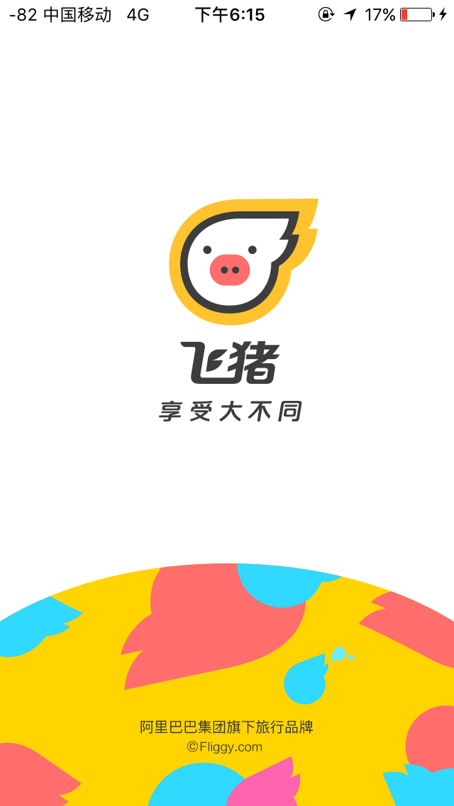
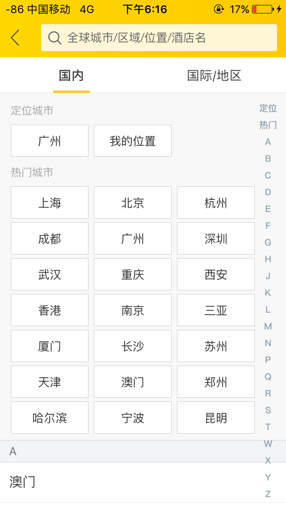
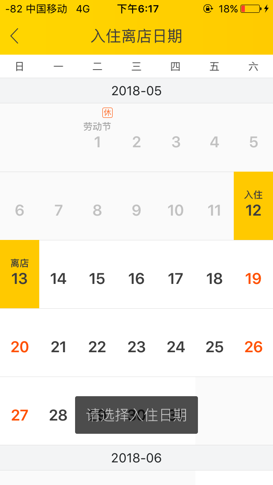
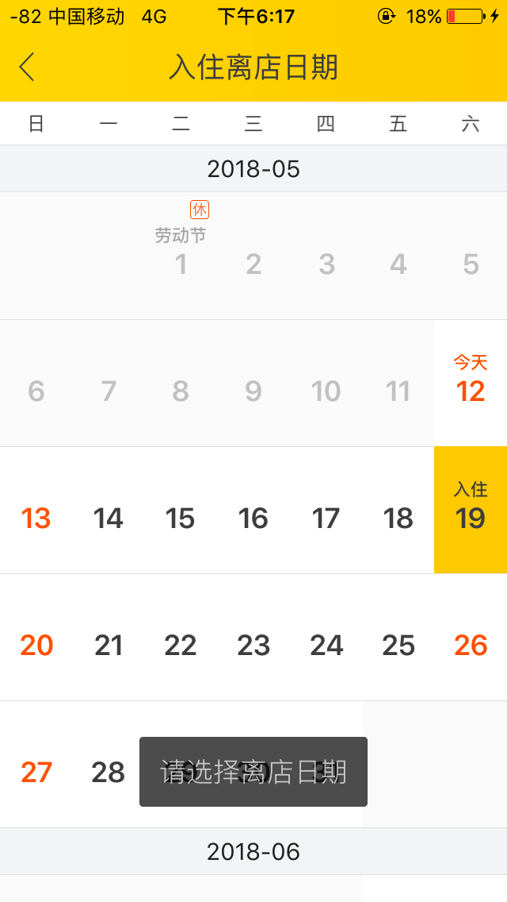
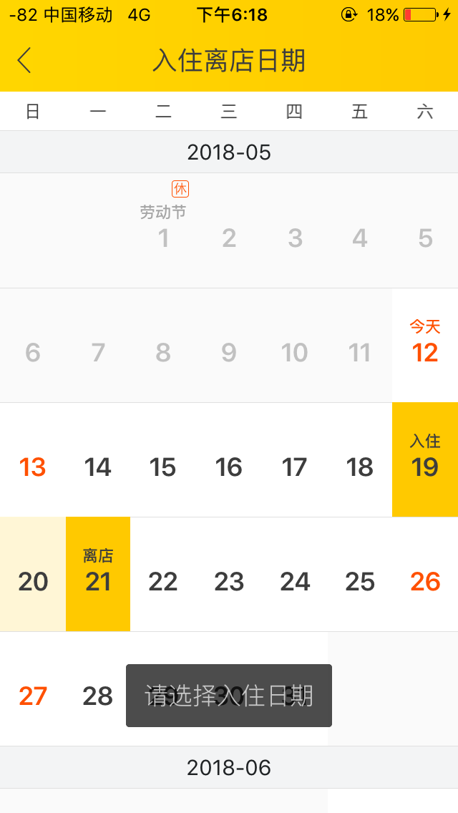
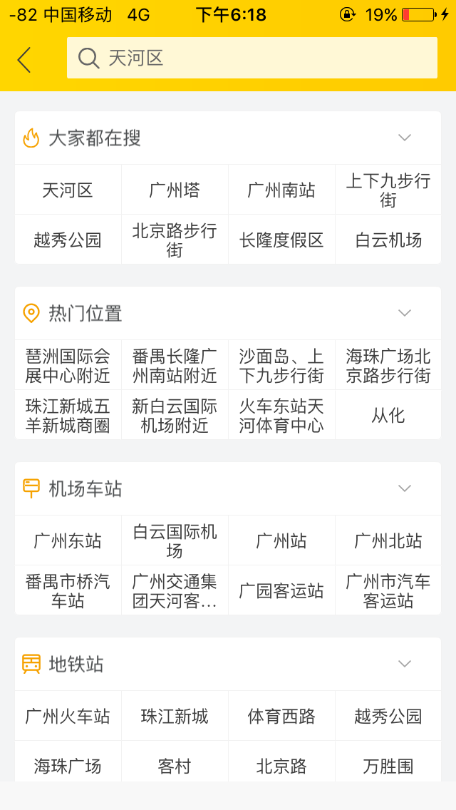
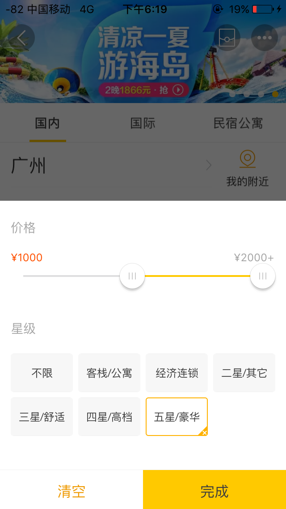
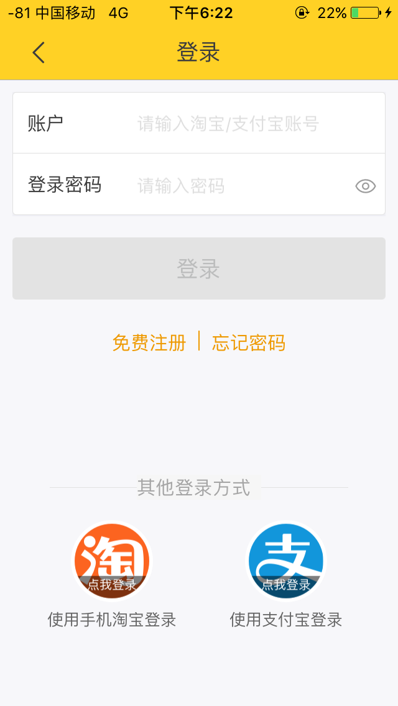

# 飞猪酒店预订文档
`飞猪`  
本文档为针对移动平台应用“飞猪”的酒店预定功能，在本文档中将展示该应用预定酒店房间的一系列流程。如需进一步了解请下载该应用。  
## Screenshot 1
首先是该应用的引导界面：  

## Screenshot 2  
然后是应用主界面：  
在主界面中有许多可以选择的功能，包括酒店，机票火车票等。  

## Screenshot 3
我们点开酒店客栈的菜单：
我们首先需要对酒店进行筛选，挑选出适合的一批酒店。  
在界面中顶上的一栏菜单中可以选择
- 国内
- 国际
- 民宿公寓    

然后下面一栏选择地址，  
再下面一栏则是入住时间及离开时间，  
最下面可以选择酒店的价格和星级。

## Screenshot 4 
首先点入位置界面，在这里我们可以快速选择定位到的地点以及一些热门城市。  
也可以按照拼音首字母来查询。  

## Screenshot 5
然后选择日期。  
在这里需要我们选择入住日期和离开日期。  
第一次点击会选择入住日期，我们选择了19号；  
然后是离开日期，我们选择21号。  
由此得到一个居住的区间。

## Screenshot 6
最后我们需要选择我们居住的城市区域，在图中该应用给我们较多的选项，其中包括机场，地铁站附近等一系列热门位置。  
我选择了珠江新城附近。  

## Screenshot 7
最后我们可以选择酒店的价格（每日价格）和酒店星级。

## Screenshot 8
选择完成后的界面如下图所示。  
我们点击开始搜索

## Screenshot 9
该界面显示的是搜索的结果，它将符合我们筛选条件的酒店都显示了出来，我们挑选一个最喜欢的。

## Screenshot 10
这张截图为我们挑选的"广州四季酒店"。里面详细列出了有关于这个酒店的信息，设施，附近街景等等。  
在这里，我们可以设置一些筛选信息如：
- 双床
- 含早
- 免费取消
- 闪电确认等等

我们选择大床。

## Screenshot 11
以下结果为大床的符合条件的所有房间，我们挑选一个喜欢的房间并点击预定。  

## Screenshot 12
需要先登陆  

## Screenshot 13
登陆完成后跳转回支付界面。
这其中我们可以确认之前的住房信息等等，并且可以附带发票。  
我们点击立即支付。

## Screenshot 14
支付绑定了支付宝。

## Screenshot 15
支付完成后应该会显示相应的支付单号等信息。

