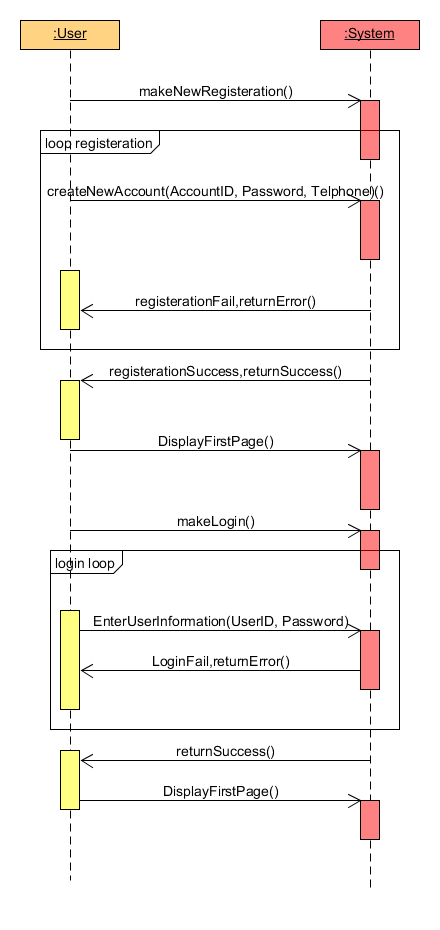
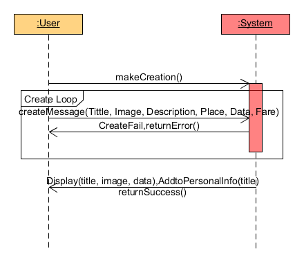
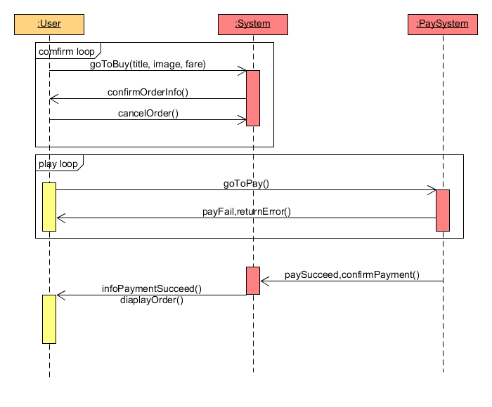
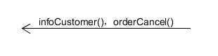

## 系统顺序图
- 用例主场景一：用户登录注册 

- 用例主场景二：发布&展示信息 

- 用例主场景三：下单 

- 用例主场景四：退款 

## 操作契约
- 契约一：createNewAccount 
	操作：createNewAccount(AccountID：int, Password:string, Telphone:int) 
	前置条件：用户正在注册 
	后置条件：创建一个新账号，将该用户的注册信息存入数据库 
  
- 契约二：EnterUserInformation 
	操作：EnterUserInformation(UserID:int, Password:string) 
	前置条件：用户正在登录 
	后置条件：核对数据库里已注册的用户信息 
  
- 契约三：createMessage 
	操作：createMessage(Tittle:string, Image:bitmap, Description:string, Place:string, Data:string, Fare:float) 
	前置条件：用户正在发布信息 
	后置条件：系统为该用户创建一条信息数据，将该信息写入数据库中，并将处理后的信息返回给用户 
  
- 契约四：Display 
	操作：Display(title:string, image:bitmap, data:string) 
	前置条件：用户确认发布信息 
	后置条件：按发布时间和分类展示在系统的不同位置 
  
- 契约五：confirmOrderInfo 
	操作：confirmOrderInfo(userID:int, orderID:long) 
	前置条件：用户正在确认订单 
	后置条件：系统确认订单并更改订单状态 
  
- 契约六：requireRefund 
	操纵：requireRefund(userID:int, orderID:long) 
	前置条件：用户正在发起退款 
	后置条件：经过系统审核后，返回请求结果，并更改订单状态 
