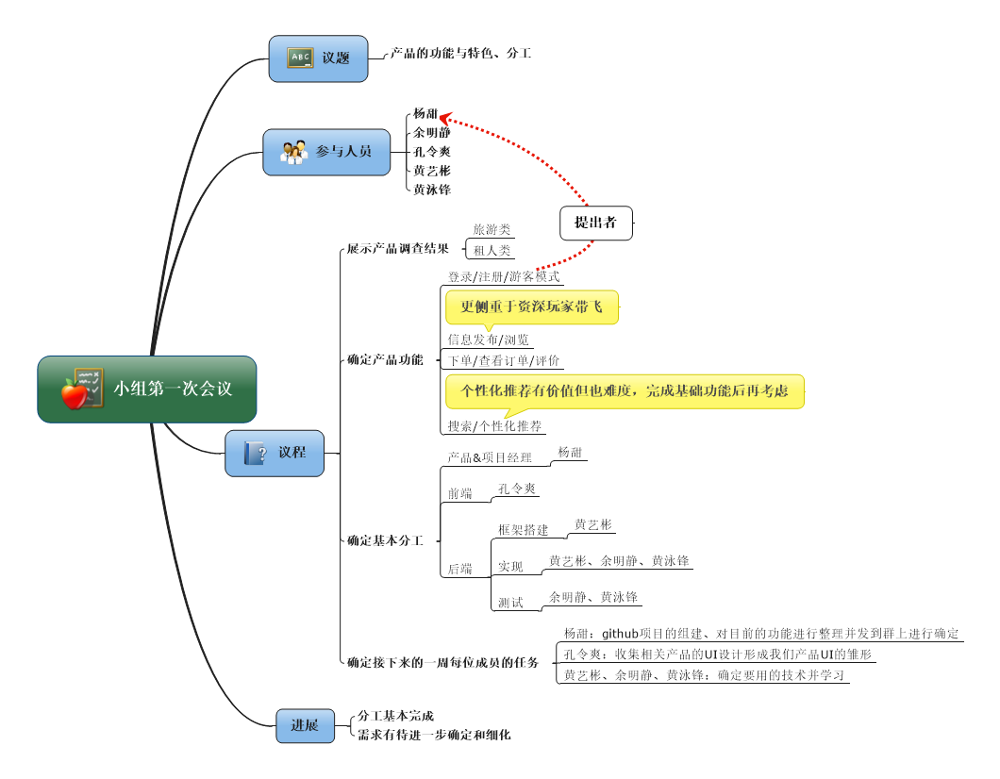
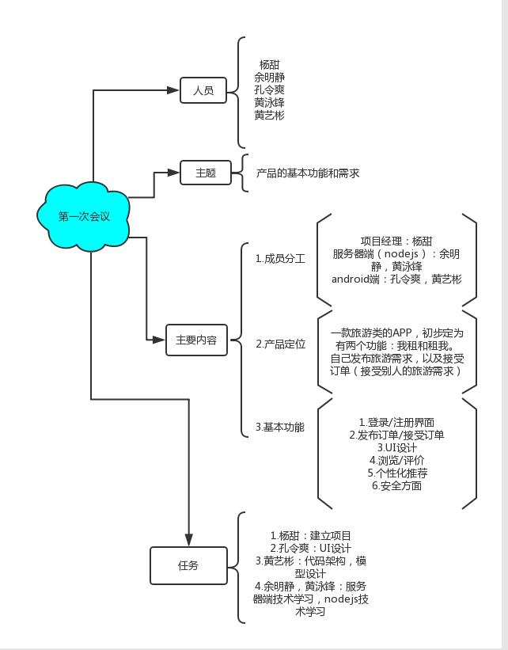

# 
项目启动及第一次会议纪要

- 会议目标：通过对有相关产品的了解，定义我们产品的服务范围（用户、利益、业务故事）、亮点与特色；完成基本的分工
- 个人任务：产品负责人向队员介绍产品调查的情况；每位队员在现场用“思维导图”记录会议过程(最后验收时再整理到个人技术报告中)，用重点标识符勾出你认为(贡献人含自己)最有价值的要点与冲突；项目经理总结本次会议
## 各成员会议“思维导图”

*credit: yt*

*credit: ymj*

*credit: kls*
